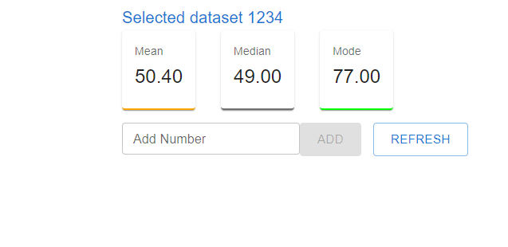

# ReactJS Coding Challenge



## Objective

Create a react application that displays 3 tiles, displaying mean, median, and mode statics via a REST API call. The user should be able to change dataset and also able to add new value to dataset.

## Requirements

1. The app shall display 3 statistics tiles: Mean, Median, and Mode. 
2. The app shall present a button which, when clicked, will cause a given dataset to be loaded (replacing the current dataset) and the dashboard display to be updated to reflect the newly
loaded data.
3. The app shall present an input field that will accept a number and a submit button which, when clicked, will cause the number to be added to the currently loaded dataset and the dashboard
tiles to update to reflect the new dataset state.


## Expected Results

### data-1234.json

| Tile       |  Default  | After adding 42 |
| :--------- | :-------: | --------------: |
| **Mean**   | 49.457050 |       49.451012 |
| **Median** | 49.000000 |       49.000000 |
| **Mode**   | 77.000000 |       77.000000 |

### data-4321.json

| Tile       |  Default  | After adding 42 |
| :--------- | :-------: | --------------: |
| **Mean**   | 50.346679 |       50.344748 |
| **Median** | 51.000000 |       51.000000 |
| **Mode**   | 82.000000 |       82.000000 |

## Tech Stack

### Client Stack

- ReactJS (Typescript)
- React Hooks
- Styled Components


## 🚀 Quick start

## Scripts

### `git clone`

```shell
   # clone this project. If you are forking it first, make sure to use your
   # own github username in place of mine ;)
   git clone https://github.com/chauhanheena/tandem-react-challenge.git
```

### `npm install`

Once you clone the project, you will want to make sure you install all dependencies to get up and running.

```shell
  npm install
```

### `npm run start`

This command runs both the server and the client concurrently in development mode. The React app runs on [http://localhost:3000](http://localhost:3000)

If you want to run the code as-if you're in production, then update the local .env file with `NODE_ENV=production`

```shell
  npm run start
```

### `npm run build`

Before deploying to your own server, make sure to build a production version of your application.

```shell
  npm run build
```

## 🧐 What's inside?

A quick look at the top level directories you'll see in this project.

    .
    ├── public
    ├── src
    ├──── components
    ├──── interfaces
    ├──── models
    ├──── services
    ├──── utility

